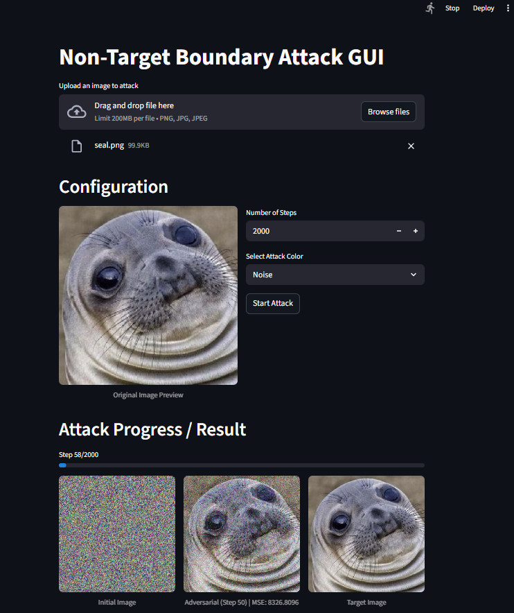

# Non-Target Boundary Attack GUI Overview

This project provides an interactive web application to visualize the Non-Target Boundary Attack, a type of adversarial attack against deep learning image classifiers.

The application allows a user to upload an image, select an initial attack image, and observe in real time as a minimally perturbed adversarial image is generated to cause a misclassification. This implementation uses a pre-trained ResNet50 model and builds upon the logic from the Non-Target Boundary Attack repository.

---

## Features

- Interactive Interface: Easily upload an image and configure attack parameters through a simple web UI.
- Multiple Initial Image Options: Start the attack from different initial images, including:
  - Solid Red, Green, or Blue images
  - A random Noise image
  - A solid color image based on the mean color of the target image
- Real-Time Visualization: Watch the adversarial sample evolve in a side-by-side comparison with the Initial Image and the Target Image. The adversarial image is updated every 10 steps (starting from step 1).
- Live Metrics: The Mean Squared Error (MSE) between the target and adversarial images is displayed and updated in real time.
- Download In-Progress Images: Download the generated adversarial image at any point during the attack. A download button is available from Step 1.  
  **Note:** Due to Streamlit’s architecture, clicking the download button while the attack is running will interrupt and stop the process.
- Customizable: Set the total number of steps to control the attack’s duration and precision.

---
## Screenshot



## How to Run

### Prerequisites

- Python 3.9+  
- pip and venv

### Setup and Installation

```bash
git clone [your-repo-url]
cd non_target_boundary_attack_GUI
```

```bash
# Create the environment
python -m venv venv

# Activate the environment
# On Windows:
.\venv\Scripts\activate
# On macOS/Linux:
source venv/bin/activate
```

```bash
pip install streamlit numpy Pillow tensorflow keras
```

### Launch the Application

```bash
streamlit run app.py
```

A new tab should open in your default web browser with the application running.

---

## Technology Stack

- Backend: Python  
- GUI Framework: Streamlit  
- Deep Learning: TensorFlow / Keras (with a pre-trained ResNet50 model)  
- Image Processing: Pillow  
